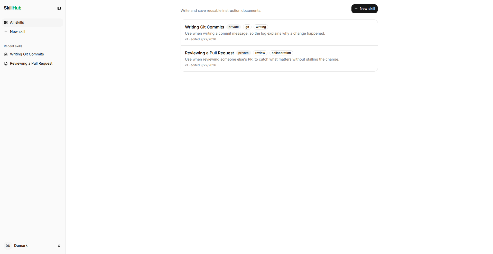
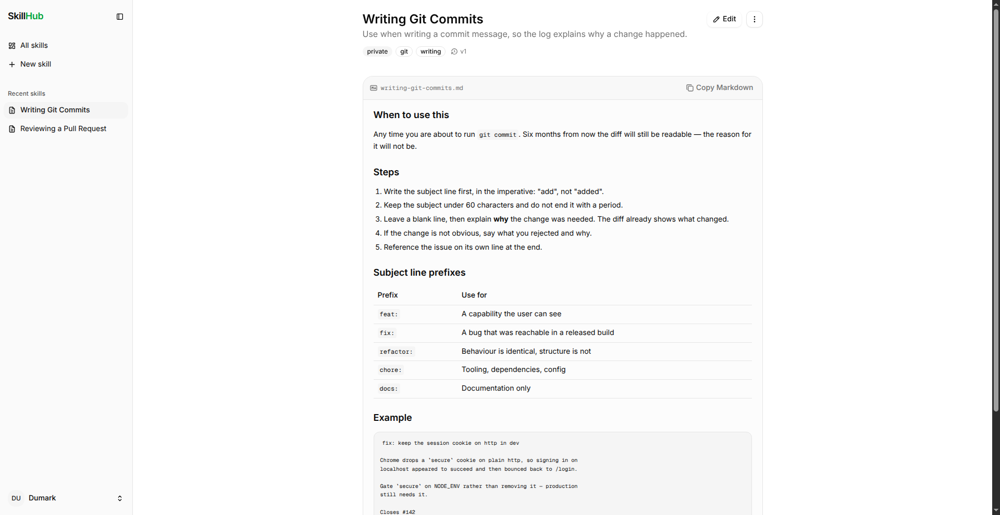
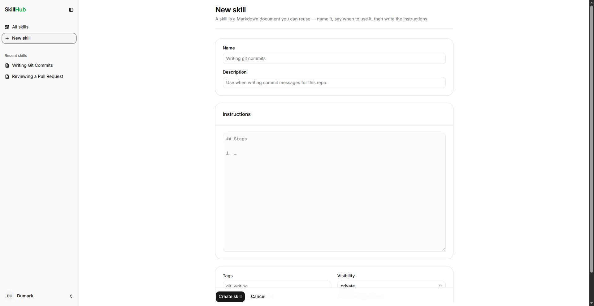
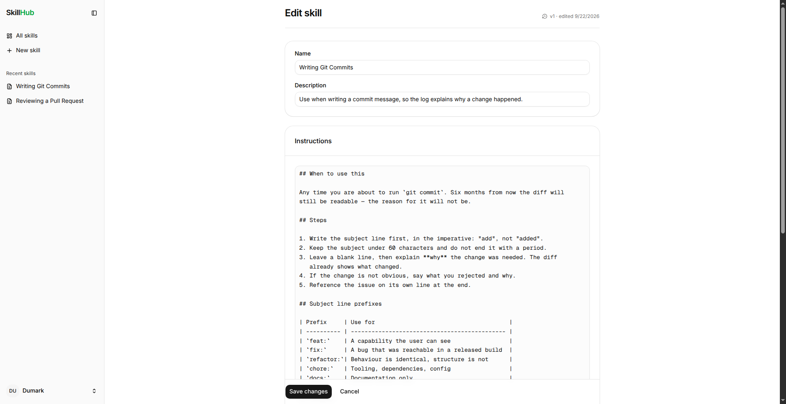
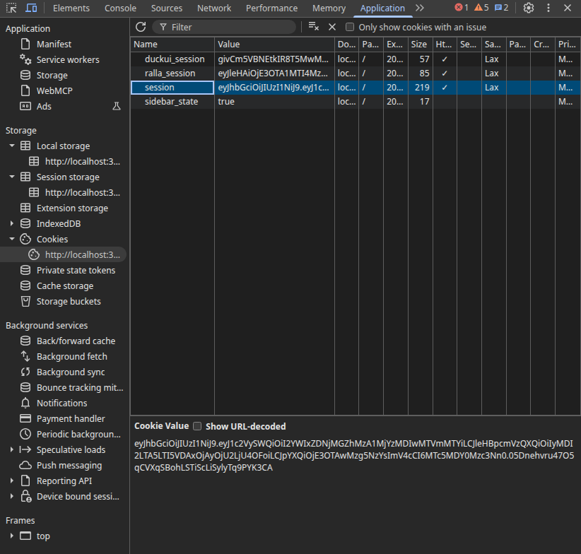
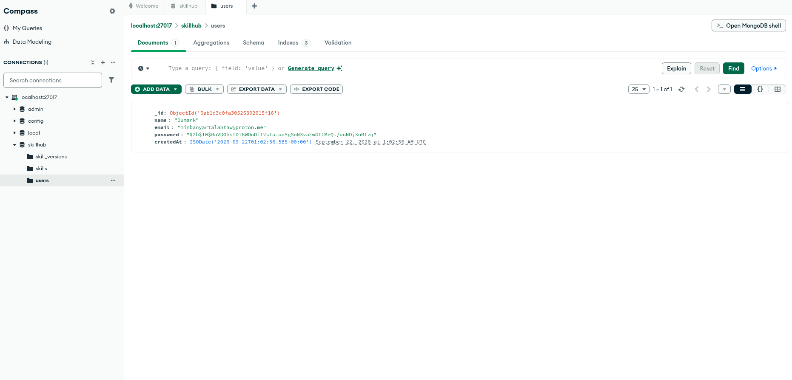

# CSX4107 Project 2

A web app where users write and save **skills** — reusable instruction documents authored in Markdown. Sign up, create a skill with a name, description, tags and visibility, then edit it over time with full version history.

## Team Members

| Name                 | Student ID |
| -------------------- | ---------- |
| Min Banyar Tala Htaw | 6715168    |
| _TBD_                | _TBD_      |

## Features

- **Authentication** — sign up / log in with email and password (bcrypt-hashed), 7-day JWT session stored in an HTTP-only cookie
- **Create skills** — name, description, Markdown instructions, comma-separated tags, and visibility (`private`, `unlisted`, `public`)
- **Rendered Markdown** — GitHub-flavoured Markdown (tables, code blocks) rendered at display time; one-click **Copy Markdown**
- **Edit & version history** — every save appends a snapshot to `skill_versions`; any old version can be restored
- **Delete** with confirmation dialog
- **Sidebar** with recent skills and a user menu

## Screenshots

### All skills

The dashboard lists the signed-in user's skills, newest first, with tags and visibility badges.



### Skill detail

Markdown is stored raw in the database and rendered on the page. The file name and a copy button sit above the content.



### Create a skill



### Edit a skill

Editing bumps the version number and writes a new snapshot.



### Session cookie

The signed JWT `session` cookie set after login, shown in browser DevTools.



### MongoDB

The `skillhub` database in MongoDB Compass with its three collections — `users`, `skills` and `skill_versions`. Passwords are stored as bcrypt hashes.



## Tech Stack

| Layer      | Technology                                                                                                                                             |
| ---------- | ------------------------------------------------------------------------------------------------------------------------------------------------------ |
| Framework  | [Next.js 16](https://nextjs.org) (App Router, JavaScript)                                                                                              |
| UI         | [React 19](https://react.dev), [shadcn/ui](https://ui.shadcn.com), [Tailwind CSS v4](https://tailwindcss.com), [Tabler Icons](https://tabler.io/icons) |
| Database   | [MongoDB 7](https://www.mongodb.com) via the official Node driver                                                                                      |
| Auth       | [jose](https://github.com/panva/jose) (JWT), [bcryptjs](https://github.com/dcodeIO/bcrypt.js)                                                          |
| Validation | [Zod](https://zod.dev)                                                                                                                                 |
| Markdown   | [react-markdown](https://github.com/remarkjs/react-markdown) + [remark-gfm](https://github.com/remarkjs/remark-gfm)                                    |
| Dev tools  | Docker Compose (MongoDB + mongo-express), ESLint                                                                                                       |
| Hosting    | Raspberry Pi 5, Nginx, pm2, Cloudflare Tunnel                                                                                                          |

> **Note:** Docker is used only to run MongoDB locally — the app itself runs with plain Node. If you don't have [Docker](https://docs.docker.com/get-docker/) installed, install it first, then start the database with:
>
> ```bash
> docker compose up -d
> ```

## Deployment

No Vercel, no Azure — the app is self-hosted on a **Raspberry Pi 5** and exposed to the internet through a **Cloudflare Tunnel**.

**Live site:** <https://parazoabac.me>

```
Browser ──HTTPS──▶ Cloudflare edge (CDN, TLS, DDoS protection)
                        │
                        │  Cloudflare Tunnel (outbound from the Pi — no open ports)
                        ▼
                Raspberry Pi 5
                        │
                   cloudflared
                        │
                     Nginx  (reverse proxy, port 80)
                        │
                 Next.js (pm2, port 3000)
                        │
                 MongoDB (Docker Compose, port 27017)
```

How it fits together:

- **Raspberry Pi 5** runs everything: the Next.js production server, Nginx, `cloudflared`, and the MongoDB container from this repo's `docker-compose.yml`. Same `.env` layout as local development, just with a real `AUTH_SECRET`.
- **Cloudflare** terminates TLS, caches static assets at its edge, and routes `parazoabac.me` to the tunnel.
- **`cloudflared`** runs on the Pi and opens an outbound tunnel to Cloudflare. Nothing is port-forwarded on the home router and the Pi has no public IP.
- **Nginx** sits in front of the app as a reverse proxy, receiving requests from the tunnel and forwarding them to Next.js on `localhost:3000`.
- **pm2** keeps the Next.js process alive — it restarts it on crash and on reboot, and keeps its logs.

Deploying a new version:

```bash
git pull
npm install
npm run build
pm2 restart skillhub
```

## Project Structure

```
skillhub/
├── app/
│   ├── (auth)/            # /login and /signup pages
│   ├── actions/           # Server Actions: auth.js, skills.js
│   ├── user/              # Authenticated area
│   │   ├── page.jsx       # Skills dashboard
│   │   └── skills/        # new/, [slug]/, [slug]/edit/
│   ├── layout.jsx
│   └── globals.css        # Tailwind v4 theme tokens
├── components/
│   ├── ui/                # shadcn/ui components
│   ├── app-sidebar.jsx
│   ├── auth-form.jsx
│   ├── skill-form.jsx
│   ├── skill-markdown.jsx
│   └── ...
├── lib/
│   ├── mongodb.js         # Shared MongoClient
│   ├── collections.js     # Collection accessors + index definitions
│   ├── definitions.js     # Zod schemas + documented collection shapes
│   ├── session.js         # JWT encrypt/decrypt, cookie handling
│   ├── dal.js             # Data access layer (current user, etc.)
│   └── skills.js          # Skill queries
├── docs/                  # Sample skills used for seeding/testing
├── public/screenshots/    # Images used in this README
├── docker-compose.yml
└── .env.sample
```

## Data Model

Three collections in the `skillhub` database:

- **`users`** — `name`, `email` (unique), `password` (bcrypt hash), `createdAt`
- **`skills`** — `ownerId`, `slug` (unique per owner), `name`, `description`, `content` (raw Markdown), `tags[]`, `visibility`, `currentVersion`, timestamps
- **`skill_versions`** — append-only snapshots: `skillId`, `version`, `name`, `description`, `content`, `authorId`, `createdAt`

Indexes are created idempotently on startup — see [lib/collections.js](lib/collections.js). The full field reference lives in [lib/definitions.js](lib/definitions.js).

## Scripts

| Command         | Description                |
| --------------- | -------------------------- |
| `npm run dev`   | Start the dev server       |
| `npm run build` | Production build           |
| `npm start`     | Serve the production build |
| `npm run lint`  | Run ESLint                 |
